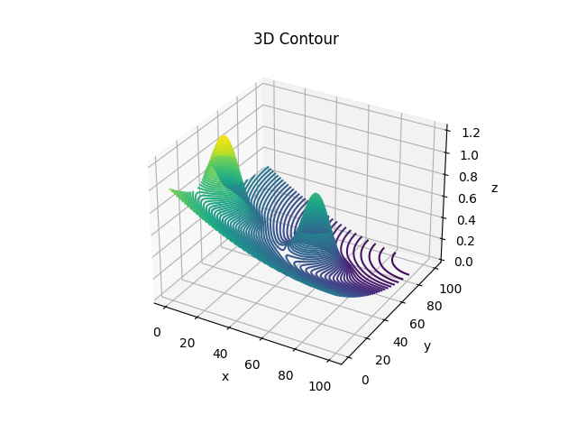

# Potential Field Traversal

  

## 1 Plotting the Potential and Vector Field

The starting position is at [0,0], the goal is at position[99, 99], and the obstacles are located at [10,40] and [60, 50].

Real world obstacles are represented as repulsors in the potential field. This adds gradients to the plot where the objects are and will cause the bot to move around them when performing gradient descent. 

This method of traversal is better than sense-act traversal because it allows you to plan your path before you begin moving. Sensing and acting on the fly can get you stuck or produce a suboptimal path. Gradient descent also keeps the robot equidistant from all obstacles as opposed to other algorithms that have wall hugging heuristics or don't take obstacle distance into account.

This algorithm works much like gravity does on objects. Here the objective is placed at the bottom of the hill and the robot at the top. The bot will therefore have a natural tendency to roll towards the objective. Obstacles are also represented as hills(repulsors) but smaller in scope. These hills cause the robot to naturally roll around obstacles as it descends.
